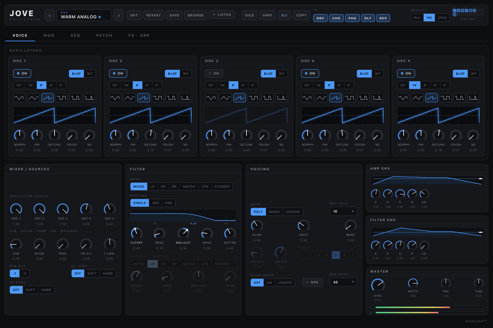
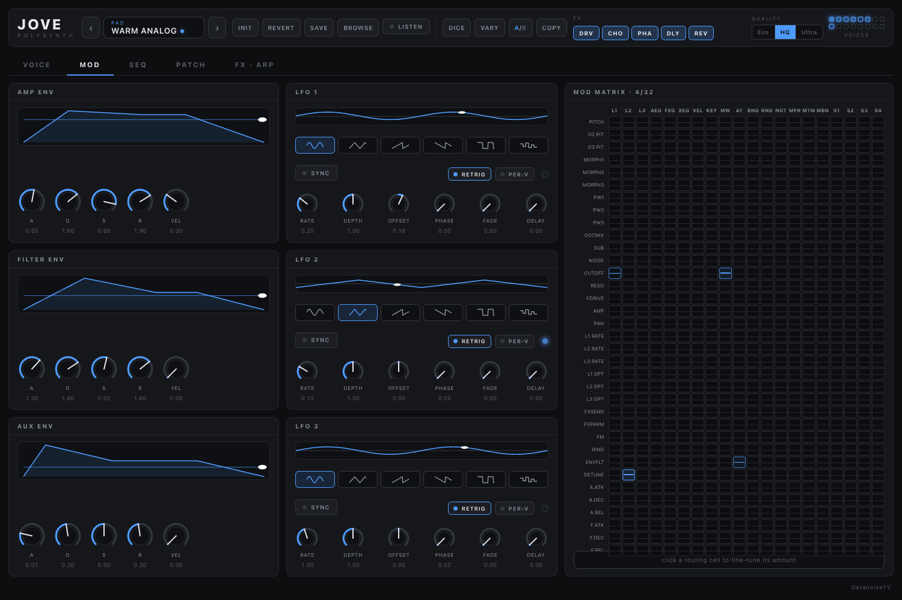
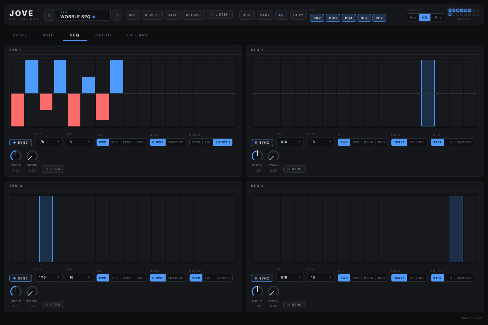
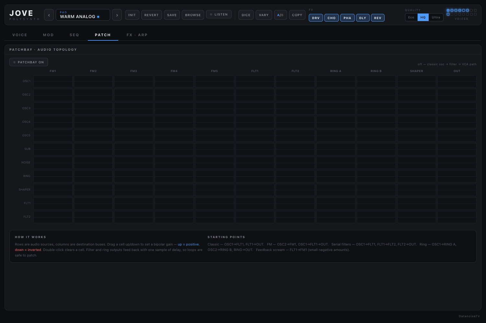
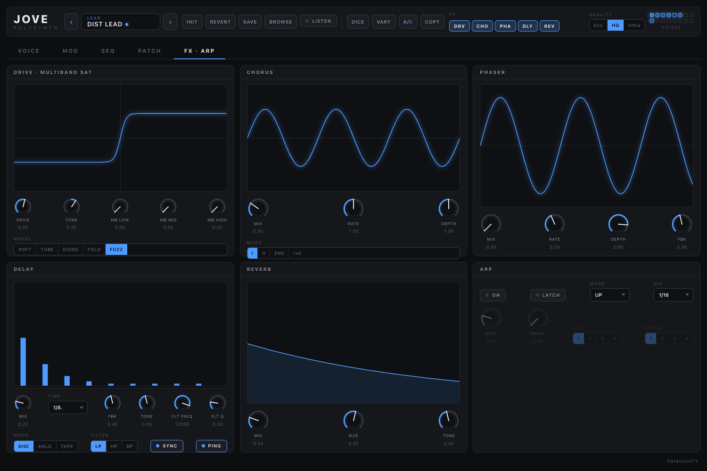

# Jove

Analog-inspired polysynth for macOS — AU, VST3, and Standalone. Five oscillators
(BLEP morphing + a 64-table wavetable bank), seven filter models including a
Moog-style ladder and a Steiner-Parker, a 32-slot modulation matrix, four step
sequencers, an EMS-style audio patchbay that rewires the voice topology, MPE,
and 140 factory presets. Built on JUCE 8 with a React WebView UI that is
two-way bound to every parameter.



## Features

**Voice engine**
- 5 oscillators: band-limited BLEP morph (sine → tri → saw → pulse with PW) or
  wavetable mode scanning a 64-table bank, per-oscillator footage, detune,
  bit-crush, and sample-rate reduction
- Sub oscillator (-1/-2 oct), noise, ring mod, osc2→osc1 FM, hard/soft sync
- Poly / mono / unison (up to 7 voices per note with detune + stereo spread),
  up to 16-voice polyphony, glide with legato mode, analog-style drift
- MPE support (per-note bend, pressure, timbre) with configurable bend range

**Filters**
- Two filters with single / serial / parallel routing
- Models: Moog-style 24 dB ladder, SVF LP/HP/BP/Notch, low-pass gate,
  Steiner-Parker — cutoff-matched so switching models keeps the brightness
- Keyboard tracking, filter drive, dedicated filter envelope

**Modulation**
- 3 envelopes (amp / filter / aux), 3 LFOs (6 shapes, tempo sync, fade/delay,
  per-voice or global phase)
- 32-slot modulation matrix edited as a source × destination grid with live
  modulation glow, painted onto the destination knobs as range arcs + moving dots
- 4 step sequencers (16 steps, melodic or curve mode, swing, direction modes)
  usable as matrix sources

**Patchbay**
- EMS-inspired audio-topology matrix: 11 source nodes × 11 destination buses
  with bipolar gains. Rewires the actual signal path — FM any oscillator from
  any node, chain filters in series, patch feedback loops (1-sample delayed,
  safe to patch)

**Effects & performance**
- Drive (5 models, loudness-neutral so drive adds harmonics, not volume),
  multiband saturation, chorus/ensemble, phaser, tempo-synced delay
  (digital/BBD/tape colour), reverb
- Arpeggiator: 12 modes, ratcheting, swing, latch, host-transport lock
- A/B compare with copy, patch randomizer (DICE = new patch from a musical
  archetype, VARY = perturb the current sound), revert-to-preset, unsaved-edits
  indicator
- 140 factory presets in 12 categories, selectable via MIDI program change and
  the host program list; user presets with category tags and in-browser delete
- Audition mode: browse presets by ear with category-appropriate demo phrases
  in the host tempo
- Eco / HQ / Ultra quality (1× / 2× / 4× oversampling of the whole voice path)

## Screenshots

| | |
|---|---|
|  |  |
|  |  |

## Building

Requires CMake 3.22+ and a C++20 toolchain (Xcode on macOS).

```sh
git clone --recurse-submodules <repo-url> jove
cd jove
cmake -B build -DCMAKE_BUILD_TYPE=Release
cmake --build build -j
```

If you cloned without `--recurse-submodules`: `git submodule update --init --recursive`.

The build installs the AU and VST3 into `~/Library/Audio/Plug-Ins` by default;
pass `-DJOVE_INSTALL_LOCAL=OFF` (CI) to skip that. For fast local iteration on
Apple silicon add `-DCMAKE_OSX_ARCHITECTURES=arm64`.

Tests (JUCE-free engine audit over every factory preset + an APVTS↔patch
round-trip):

```sh
ctest --test-dir build --output-on-failure
```

## MIDI implementation

| Message | Function |
|---|---|
| Note on/off, velocity | Voices (velocity routable in the matrix) |
| Pitch bend | Global bend (configurable range); per-note in MPE mode |
| CC 1 | Mod wheel (matrix source) |
| CC 64 | Sustain pedal |
| CC 74 | MPE timbre (per-note, MPE mode) |
| CC 123 | All notes off |
| Channel / poly pressure | Aftertouch (matrix source); per-note in MPE mode |
| Program change | Factory preset 0–139 (bank 0) |

## Presets

User presets are stored as XML at
`~/Library/Application Support/DatanoiseTV/Jove/Presets` (macOS). Factory
presets are compiled in; the browser shows each factory patch's MIDI program
number.

## License

GPL-3.0-or-later. See [LICENSE](LICENSE).
